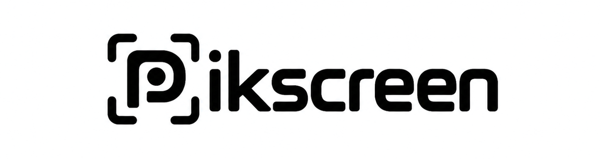

<p align="center">
  <picture>
    <source media="(prefers-color-scheme: dark)" srcset="src/assets/pikscreen-wordmark-dark-v2.png">
    
  </picture>
</p>

<p align="center"><strong>Screen Studio polish for Linux — directed live as you record.</strong></p>

<p align="center">Place smooth zoom cues during the take, then refine every move non-destructively.</p>

<p align="center">
  
  
  
</p>

---

PikScreen is a Linux-first Wayland fork of
[Recordly](https://github.com/webadderallorg/Recordly) for polished product
demos, tutorials, and walkthroughs. It records a monitor or a real application
window, captures cursor and click activity, turns keyboard markers into smooth
camera moves, and opens the result in a non-destructive editor before export.

> [!IMPORTANT]
> PikScreen is early alpha software. The recording and editing pipeline is
> usable, but packaging, compositor integration, and hardware compatibility
> still need broader testing.

## What works

- Monitor and application-window capture through PipeWire and desktop portals
- 60, 120, and 180 FPS recording profiles
- Configurable CRF quality profiles
- System audio and microphone capture with independent levels and devices
- Smooth cursor rendering, cursor sizing, cursor hiding, and click effects
- Tap or hold `Alt` to create zoom markers while recording
- `Shift` + `Alt` markers that hide the rendered cursor during the zoom
- Smooth camera transitions between overlapping zoom markers
- Bundled and custom backgrounds
- Optional custom cursor image
- Bottom-dock cropping for supported monitor capture paths
- Optional V4L2 webcam bubble
- Three-second recording countdown and capture border
- Post-recording editor for zoom timing, trim, scene, cursor, and export changes
- Save As MP4 export

The recording HUD is hidden before capture begins so it cannot appear in the
video. Press `Ctrl+Shift+R`, or choose **Stop recording** from the tray menu, to
finish a recording.

## Desktop support

PikScreen targets Wayland. It has been developed and manually exercised on:

| Desktop/compositor | Current path |
| --- | --- |
| Niri | Niri IPC plus PipeWire/wlr capture |
| KDE Plasma | xdg-desktop-portal-kde and PipeWire |
| GNOME | Mutter ScreenCast, PipeWire, and the bundled Shell guide |
| Hyprland | xdg-desktop-portal-hyprland, PipeWire, and the optional input helper |

Niri's richest cursor and window tracking currently depends on IPC additions
that are under upstream review. Other Niri installations can require the
matching patched compositor build until those APIs are available upstream.

X11, Windows, and macOS are not supported by this alpha.

## Requirements

PikScreen uses Tauri 2, Rust, TypeScript, PipeWire, GStreamer, and FFmpeg.

On Arch Linux:

```bash
sudo pacman -S --needed \
  base-devel rust nodejs npm \
  webkit2gtk-4.1 gtk3 libayatana-appindicator \
  pipewire gstreamer gst-plugins-base gst-plugins-good \
  gst-plugins-bad gst-plugins-ugly gst-libav ffmpeg
```

The native on-screen guide helper also needs GTK 4 and GTK4 Layer Shell:

```bash
sudo pacman -S --needed gtk4 gtk4-layer-shell
```

Audio capture expects a PipeWire Pulse-compatible `pactl` service.

## Build and run

```bash
git clone https://github.com/pikyusufaslan/pikscreen.git
cd pikscreen
npm install
bash tools/build-guide.sh
npm run tauri dev
```

Production build:

```bash
npm run tauri build
```

The source tree also contains optional compositor helpers:

- `tools/build-hyprland-input.sh` builds the Hyprland input bridge against the
  installed Hyprland development files.
- `tools/pikscreen-gnome-guide-extension/` contains the GNOME Shell guide
  extension used for local countdown, marker, and recording feedback.
- `tools/pikscreen-kwin-hide-guides.js` keeps PikScreen's private guide overlays
  out of KWin recordings.

For the cursorless Niri `wf-recorder` path, point PikScreen at the patched
helper when it is not in the expected adjacent development directory:

```bash
export PIKSCREEN_CURSORLESS_RECORDER_BIN=/absolute/path/to/wf-recorder
```

## Controls

- `Alt` tap: create a three-second zoom at the current pointer position
- Hold `Alt`: keep the zoom active until release
- Hold `Shift`, then tap or hold `Alt`: create the same zoom with the rendered
  cursor hidden
- `Ctrl+Shift+R`: stop the active recording

The blue and orange marker guides are local feedback only and are excluded from
the finished recording on supported compositor integrations.

## Project status

This repository is the first public alpha. Useful bug reports should include:

- compositor and version
- desktop portal backend and version
- GPU and driver
- selected source type (monitor or window)
- relevant terminal output

Please do not attach recordings that contain private information.

## Attribution

PikScreen is a fork of
[Recordly](https://github.com/webadderallorg/Recordly), licensed under the GNU
Affero General Public License v3. Recordly itself began as a fork of OpenScreen
by Siddharth Vaddem. PikScreen is an independent project and does not use the
Recordly name or branding.

See [THIRD_PARTY_NOTICES.md](THIRD_PARTY_NOTICES.md) for the complete notices.

## License

PikScreen is licensed under
[GNU AGPL-3.0-or-later](LICENSE.md). If you distribute a modified version or
make one available as a network service, the corresponding source must remain
available under the same license.
